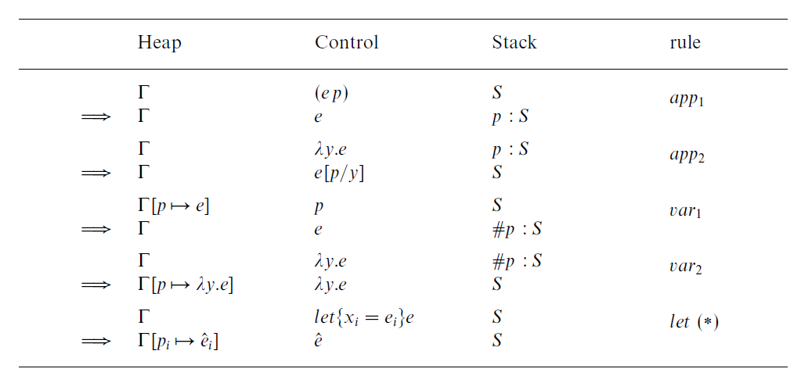

# MrClean
## Abstract State Machine specs


## GUI

- (monomer)[https://hackage.haskell.org/package/monomer] - This one looks simplish

made right & clean

```haskell

data Expr = Number Int | Variable String | Add Expr Expr | Mult Expr Expr | CallFunction String [Expr] | Function [String] Expr derives (Show)
foo(x, y+1) --> CallFunction "foo" [Variable "x", Add (Variable "y") (Number 1)] -->
foo(x, y) = x + y --> Function ["x", "y"] (Add (Variable "x") (Variable "y"))
reduceVal :: Exrp -> Int
reduceVal (Add (Number n) (Number m)) = reduce Number (n + m)
reduceVal (Number n) = n

tree = Add (Number 1) (Number 2) -- === 1 + 2
btree = tree `Add` (Number 3) -- === (1+2)+3

a = Add (Number n) (Number m)
b = a $ Add (Number n) (Number m)

expr = Add (Number n) (Number M)

reduce :: nargs -> result

z <- (expr)

f: f(x) + 1 == x -> f(x) = x - 1

10 + 10 -> 20

a = 10
foo(x, y)
~(x, y) -> foo(x + y, x)

substitute :: Expr -> String -> Expr -> Expr
substitute (Variable varname) varname_replace replace_tree | varname == varname_replace = replace_tree
substitute (Add lhs rhs) varname_replace replace_tree = Add (replace lhs varname_replace replace_tree) (replace rhs varname_replace replace_tree)

foo(x) = x

foo(2) = 2


```

## Syntax

$ is evaluation / reduction / call / invoke
| is pipe
() is scope
:= is assignment
-> is function declaration
\d+ is integer
// is single line comment

/\* \*/ is multiline

## References

- [Parsec](https://hackage.haskell.org/package/parsec)
- [Clean](<https://en.wikipedia.org/wiki/Clean_(programming_language)>)
- [Graph-Reduction (concept)](https://en.wikipedia.org/wiki/Graph_reduction)

# Parsec Study

Parser is Monad => Applicative => Functor
Also Alternative

How parser combination works in essence

```haskell
val1 :: Parser Val1
val1 = constructorOfVa1 <$> {-chained parsers-}
```

An example of parsing `MyType`

```haskell
-- (<$>) :: (Functor f) => (a->b) -> f a -> f b
-- (<*>) :: (Applicative f) => f (a -> b) -> f a -> f b

data MyType a b c = myConstructor a b c
-- thus
myConstructor :: a -> b -> c -> MyType a b c

-- provided impl of these (basics like Int and Char are provided by parsec lib)
p1 :: Parser a
p2 :: Parser b
p3 :: Parser c

-- incremental
p1' :: Parser (b -> c -> MyType a b c)
p1' = foo <$> p1

p2' :: Parser (c -> MyType a b c)
p2' = p1' <*> p2

p3' :: Parser (MyType a b c)
p3' = p2' <*> p3

-- or simply
p3'' :: Parser (MyType a b c)
p3'' = foo <$> p1 <*> p2 <*> p3

-- with do
p3''' :: Parser (MyType a b c)
p3''' = do
    a' <- p1
    b' <- p2
    c' <- p3
    return(myConstructor a' b' c')
```

`p <?> s` displays error message `s` when `p` fails

```haskell
<?> :: Parser a -> String -> Parser a
```

Parsers should follow lexeme structure, meaning they consume _trailing_ whitespace

```haskell
lexeme :: Parser a -> Parser a
lexeme p = p <* spaces
```

Top level parser should be the only parser consuming _leading_ whitespace, but a general
method is good to have

```haskell
leadingWS :: Parser a -> Parser a
leadingWS = spaces *> p
```

## `try` vs `<|>`

```haskell
try ::  Parser a -> Parser a
(<|>) :: (Alternative f) =>  f a -> f a -> f a
```

The `a <|> b` (or _option_) operator tries to apply the first parser `a` and **if** it
fails **without** consuming input, the other parser `b` is used. If `a` were to fail after
consuming input, the entire expression fails.

`try a` creates a new parser that _if_ `a` fails, backtracks the consumed stream and thus
behaves as if no input was consumed in the case of `<|>`. Usefull for parsers that
tries to parse a large (context aware?) structure.

## For Autopilot

```haskell
{- ===== Language Explanation =====
  Functional language that mimics lambda calculus
  Variables are alphanumerical strings (eg x, x1, my_var)
  Abstraction (or functions) are written as (x -> M), where x is a bound variable and M is an expressions
  Applications are written as (N|M) where N is applied to the function M

  Parenthesis are used to group expressions e.g: (x -> (x|x)) is a valid expression
  You can assign to variables with the following syntax (x := M), which means that M is assigned to x
  reserved operators: ->, |, :=, $

  Examples:
  assign x to the identity function: x := (x -> x)
  assign y to the function that takes a function and applies it to itself: y := (f -> (f|f))
  assign z to the function that takes a function and applies it to itself twice: z := (f -> ((f|f)|f))
  etc...
  1 + 2 * 3 = 7
  1 + (2 * 3) = 7
  (1 + 2) * 3 = 9

  $ reduces the expression to its beta normal form
  -> is used to define functions or lambdas (eg: x -> x)
  | is used to apply functions (eg: (x|x))
  := is used to assign a value to a variable
  arithmetic operators:
    _implicit_addition: 1 2 = 3
    _implicit_multiplication: 3 2 = 6
    _implicit_subtraction: 3 2 = 1
    _implicit_division: 6 2 = 3
    _implicit_modulo: 7 2 = 1
    _implicit_exponentiation: 2 3 = 8
    _implicit_factorial: 5! = 120
    _implicit_and: 1 1 = 1
    _implicit_or: 1 0 = 1
    _implicit_xor: 1 0 = 1
    _implicit_not: 1 = 0
    _implicit_greater_than: 2 1 = 1
    _implicit_less_than: 1 2 = 1
    _implicit_greater_than_or_equal_to: 2 2 = 1
    _implicit_less_than_or_equal_to: 2 2 = 1
    _implicit_equal_to: 2 2 = 1
    _implicit_not_equal_to: 2 1 = 1
-}
```
